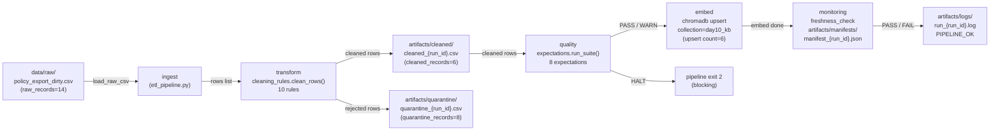

# Kiến trúc pipeline — Lab Day 10

**Nhóm:** 16_2  
**Cập nhật:** 2026-04-15

---

## 1. Sơ đồ luồng

**Điểm đo freshness:** tại bước Monitor — so sánh `latest_exported_at` trong manifest với `datetime.now(UTC)`, SLA = 24h.

**run_id:** ghi vào log dòng đầu `run_id={run_id}` và vào manifest JSON field `run_id`.

**quarantine:** mỗi row bị loại ghi ra `artifacts/quarantine/quarantine_{run_id}.csv` kèm trường `reason`.

---

## 2. Ranh giới trách nhiệm

| Thành phần | Input | Output | Owner nhóm |
|------------|-------|--------|------------|
| **Ingest** | `data/raw/policy_export_dirty.csv` | `List[Dict]` rows in-memory | HoangNgocThach |
| **Transform** | `List[Dict]` raw rows, flag `apply_refund_window_fix` | `(cleaned, quarantine)` lists + 2 CSV artifacts | HoangNgocThach |
| **Quality** | cleaned list, `run_id` | `ExpectationResult` list; exit code 0/2 | HoangNgocThach |
| **Embed** | cleaned list, ChromaDB path, collection name | upsert count, prune count, collection `day10_kb` | HoangNgocThach |
| **Monitor** | manifest JSON path, `FRESHNESS_SLA_HOURS` | `PASS / WARN / FAIL` + detail dict; log line | HoangNgocThach |

---

## 3. Idempotency & rerun

Pipeline dùng **upsert theo `chunk_id`** — mỗi chunk có ID ổn định được tính bằng SHA-256 của `doc_id|chunk_text|seq`.

Quy trình embed mỗi lần chạy:
1. **Prune:** xoá khỏi ChromaDB tất cả vector `doc_id` ∈ `ALLOWED_DOC_IDS` mà `chunk_id` không nằm trong cleaned batch mới (`embed_prune_removed=N`).
2. **Upsert:** ghi/ghi đè từng chunk theo `chunk_id`.

Chạy lại 2 lần với cùng cleaned CSV → `embed_prune_removed=0`, `embed_upsert count=6` — không tạo duplicate. Log sprint3-clean minh chứng: `embed_prune_removed=2` (xoá 2 vector bẩn từ inject-bad), `embed_upsert count=6`.

---

## 4. Liên hệ Day 09

Day 10 dùng collection riêng `day10_kb` (không ghi đè collection Day 09) để:
- Đảm bảo **publish boundary** rõ ràng — agent Day 09 không bị ảnh hưởng khi pipeline Day 10 inject corruption hoặc chạy thử nghiệm.
- Cùng `chroma_db` path (`./chroma_db`) nên multi-agent Day 09 có thể tham chiếu `day10_kb` bằng cách đổi biến môi trường `CHROMA_COLLECTION=day10_kb` trong `.env` của Day 09 — không cần re-embed.

Sau khi pipeline Day 10 ổn định (`PIPELINE_OK`, sprint3-clean), `day10_kb` chứa 6 chunk sạch từ 4 doc_id đã kiểm chứng — sẵn sàng cho multi-agent Day 09 sử dụng.

---

## 5. Rủi ro đã biết

- **Freshness SLA FAIL trên CSV mẫu:** `exported_at=2026-04-10T08:00:00` cố tình cũ hơn 5 ngày để minh hoạ kịch bản stale. Trên production cần cập nhật `FRESHNESS_SLA_HOURS` hoặc dùng data source có timestamp thật.
- **Eval keyword-based:** `eval_retrieval.py` dùng keyword match, không dùng LLM-judge — có thể false-positive nếu keyword xuất hiện trong context không liên quan.
- **Không có WARN threshold cho freshness:** hiện chỉ có PASS / FAIL (24h). Cần thêm WARN threshold (vd 24h < age < 48h) cho production.
- **Rule 2 & 3 chỉ minh chứng qua quarantine log:** chưa có inject scenario riêng trong eval CSV cho `chunk_too_short` và `missing_exported_at`.
